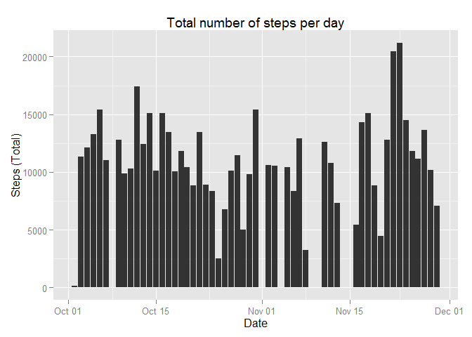
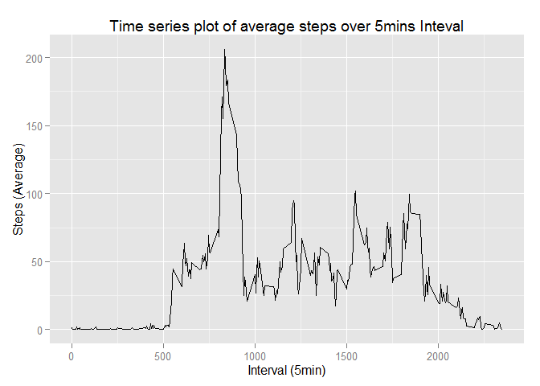
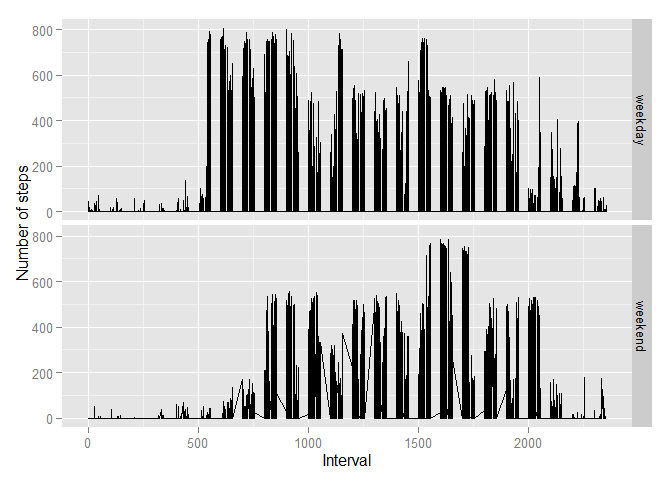

# Reproducible Research: Peer Assessment 1


## Loading and preprocessing the data


```r
echo = TRUE 
library(ggplot2)

activity <- read.csv("activity.csv", colClasses = c("integer", "Date", "numeric"))
```

## What is mean total number of steps taken per day?


```r
complete_cases <- activity[complete.cases(activity),]
cc_sum <-aggregate(steps~date, data=complete_cases, FUN="sum")

bplot <- ggplot(cc_sum, aes(date, steps))
bplot + geom_bar(stat="identity") + labs(title = "Total number of steps per day", x = "Date", y = "Steps (Total)")
```

 

```r
steps_mean <- mean(cc_sum$steps)
steps_median <- median(cc_sum$steps)
```

Mean total number of steps taken per day:


```r
mean(cc_sum$steps)
```

```
## [1] 10766.19
```

Median total number of steps taken per day:


```r
median(cc_sum$steps)
```

```
## [1] 10765
```

## What is the average daily activity pattern?


```r
steps_average <- aggregate(complete_cases$steps, list(interval = complete_cases$interval), FUN="mean")
tsplot <- ggplot(steps_average, aes(interval, steps_average$x))
tsplot + geom_line() + labs(title = "Time series plot of average steps over 5mins Inteval", x = "Interval (5min)", y = "Steps (Average)")
```

 

Interval contaiing the max steps :


```r
steps_average[steps_average$x == max(steps_average$x), ]
```

```
##     interval        x
## 104      835 206.1698
```

## Imputing missing values

Total number of missing values : 


```r
sum(is.na(activity)) 
```

```
## [1] 2304
```

We are going to fill the missing values in the dataset with the mean value for that day :


```r
filled_cases <- activity
steps_average_per_day <- aggregate(steps~date, data=complete_cases, FUN="mean")

for (caseIdx in 1:nrow(filled_cases))
{
  if(is.na(filled_cases$steps[caseIdx]))
  {
      day_average <- steps_average_per_day[steps_average_per_day$date == activity$date[caseIdx], "steps"]
            
      if(length(day_average) == 0)
      {
        day_average <- 0
      }
      
      filled_cases$steps[caseIdx] <- day_average
  }  
}

cc_sum2 <-aggregate(steps~date, data=filled_cases, FUN="sum")

bplot2 <- ggplot(filled_cases, aes(date, steps))
bplot2 + geom_bar(stat="identity") + labs(title = "Total number of steps per day - Missing data were filled with day average", x = "Date", y = "Steps (Total)")
```

 

Mean total number of steps taken per day:


```r
mean(cc_sum2$steps)
```

```
## [1] 9354.23
```

Median total number of steps taken per day:


```r
median(cc_sum2$steps)
```

```
## [1] 10395
```

Mean and median values significantly differ.

## Are there differences in activity patterns between weekdays and weekends?


```r
filled_cases$isweekday <- factor(weekdays(filled_cases$date))
levels(filled_cases$isweekday) <- list(weekday = c("Monday", "Tuesday", "Wednesday", "Thursday", "Friday"), weekend = c("Saturday", "Sunday"))

steps_average2 <- aggregate(filled_cases$steps, list(interval = filled_cases$interval, filled_cases$isweekday), FUN="mean")
names(steps_average2)[3] <- "steps"
names(steps_average2)[2] <- "isweekday"

tsplot2 <- ggplot(filled_cases, aes(interval , steps))
tsplot2 + geom_line() + facet_grid(isweekday ~ .) + labs(x = "Interval", y = "Number of steps")
```

 
